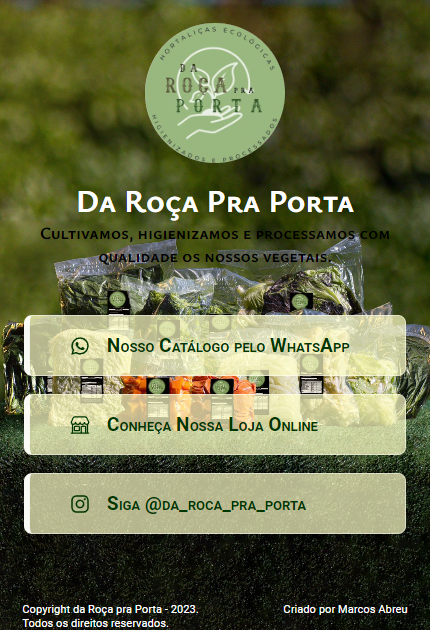

<h1 align="center">Projeto Da Roça Pra Porta</h1>

 

  

## 🚀 Tecnologias

Esse projeto foi desenvolvido com as seguintes tecnologias:

- Vite, ESlint
- HTML,CSS e JavaScript
- Node e NPM
- Git e Github

- [Acesse o projeto finalizado, online]()

## :memo: Licença

Esse projeto está sob a licença MIT.